Azure Fundamentals - Migrate SQL Server to Azure SQL Database
Sep. 2023

 

### Contents

- [Exercise 1](#exercise-1)

  - [Azure Database Migration Service の作成](#task-1-azure-database-migration-service-の作成)

  - [セルフホステッド統合ラインタイムの作成と登録](#task-2-セルフホステッド統合ラインタイムの作成と登録)

- [Exercise 2](#exercise-2)

  - [移行先 SQL Database の作成](#task-1-移行先-sql-database-の作成)

  - [サーバー ファイアウォールの設定](#task-2-サーバー-ファイアウォールの設定)

- [Exercise 3](#exercise-3)

  - [Azure Data Studio のインストール](#task-1-azure-data-studio-のインストール)

  - [拡張機能のインストール](#task-2-拡張機能のインストール)

- [Exercise 4](#exercise-4)

  - [SQL Server, SQL Database への接続](#task-1-sql-server-sql-database-への接続)

  - [データベース スキーマの移行](#task-2-データベース-スキーマの移行)

- [Exercise 5](#exercise-5)

  - [データベースの移行](#task-1-データベースの移行)

- [Exercise 6](#exercise-6)

  - [メンテナンス期間の構成](#task-1-メンテナンス期間の構成)

  - [バックアップの構成](#task-2-バックアップの構成)

 

## Exercise 1

### Task 1: Azure Database Migration Service の作成

- [Azure ポータル](https://portal.azure.com) へアクセス

- トップ画面の検索バーに **azure database migration service** と入力し、表示される候補より **Azure Database Migration Service** を選択

  

- **＋ 作成** をクリック

  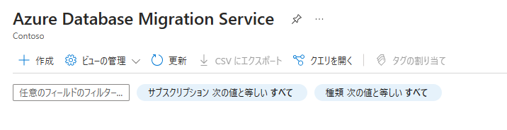

- 移行シナリオと Database Migration Service

  - **ソース サーバーの種類**: SQL Server

  - **ターゲット サーバーの種類**: Azure SQL Database

  - **Database Migration Service**: Data Migration Service

    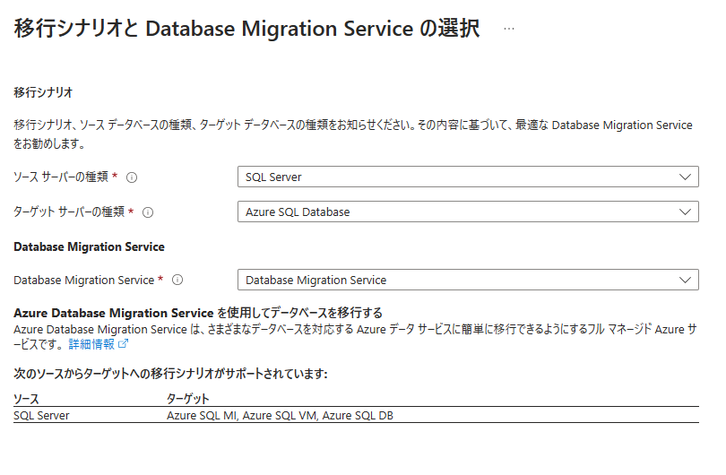

- **選択** をクリック

- Create Data Migration Service

  - **Basics**

    - **Subscription**: ワークショップで使用中のサブスクリプション

    - **Resource group**: ワークショップで使用中のリソース グループ

    - **Instance details**

      - **Location**: リソース グループと同じリージョンを選択

      - **Migration service name**: 任意

        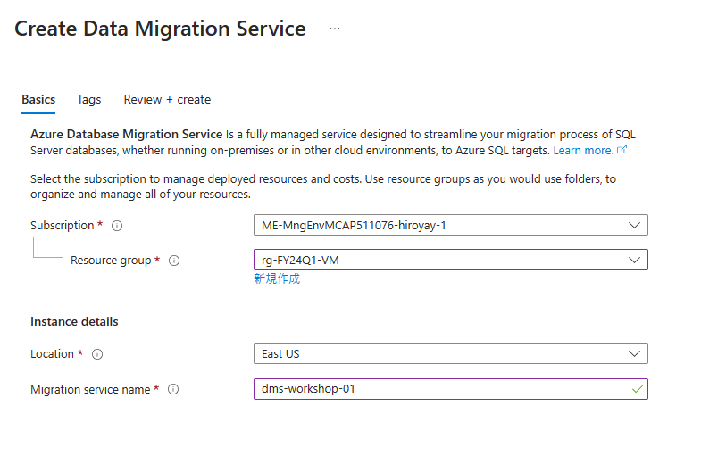

- **Review + create** をクリック

- **Create** をクリック

  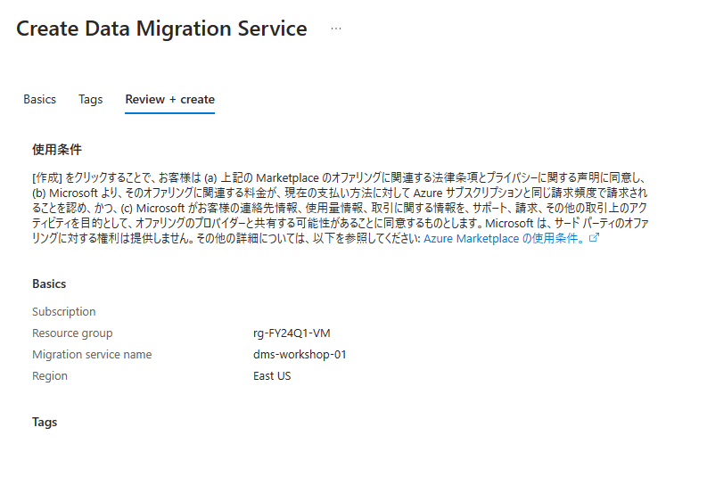

 

### Task 2: セルフホステッド統合ラインタイムの作成と登録

- 作成した Database Migration Service の管理ブレードを表示

- **統合ランタイム** を選択し、**Congigure integration runtime** をクリック

  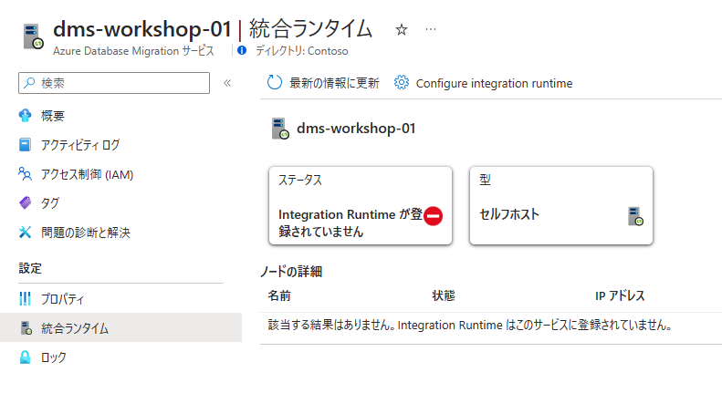

- **Download and install the integration runtime** をクリック

  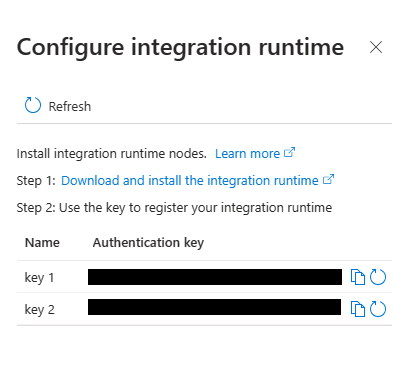

- Web ブラウザが起動し Microsoft Integration Runtime のダウンロード サイトが表示

- **Download** をクリック

  

   

- 最新バージョン (IntegrationRuntime_5.33.8615.3.msi) を選択し、**Download** をクリック

- ダウンロード完了後、**Open file** をクリックし、インストーラーを起動

- **Next** をクリック

  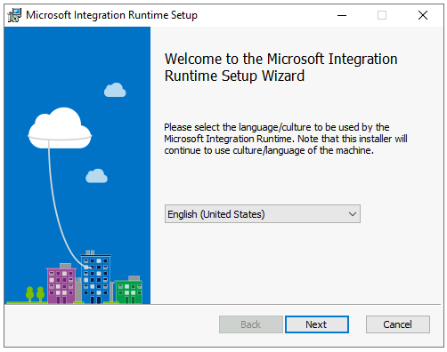

- **I accept the terms in the License Agreement** にチェックを付け、**Next** をクリック

  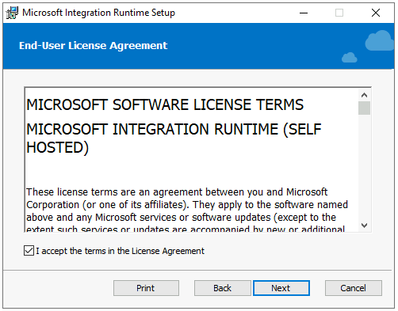

- インストール先を確認し **Next** をクリック

  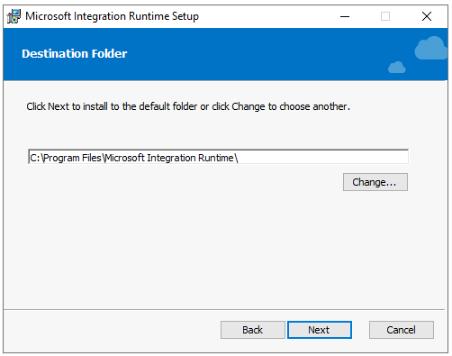

- **Install** をクリックし、インストールを開始

  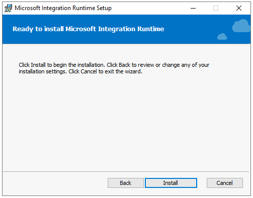

- **Finish** をクリック

  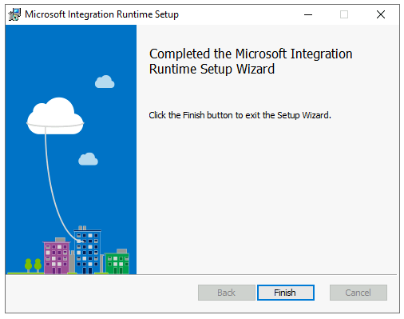

- Microsoft Intagration Runtime Configuration Manager が起動

- Azure ポータルから Configure integration runtime に表示されているキーをコピーし貼り付け **Register** をクリック

  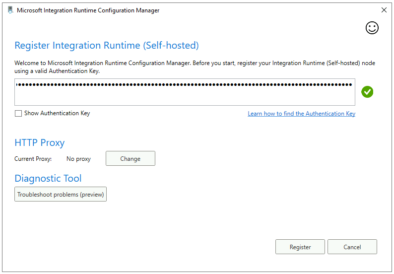

- **Finish** をクリック

  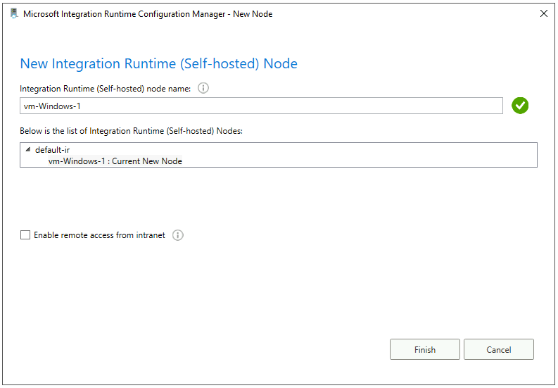

- 再度 **Regiter** をクリックし、登録を実行

- 正常に登録が完了したことを確認し **Close** をクリック

  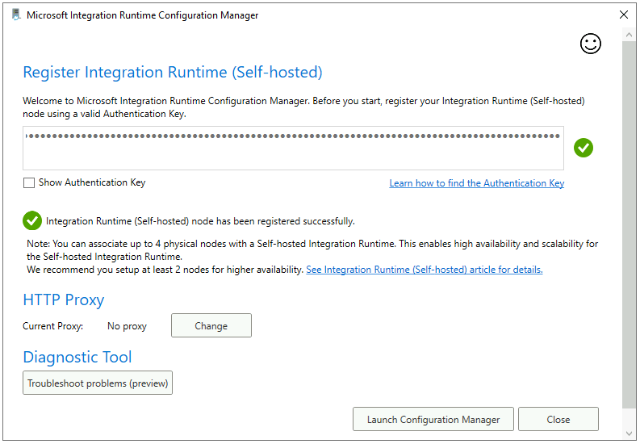

- Azure ポータルでも統合ラインタイムのノードが登録されていることを確認

  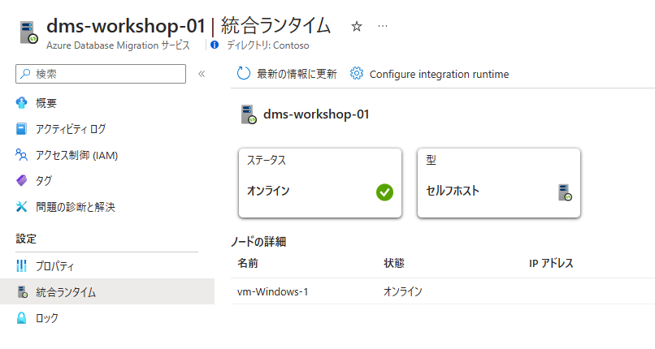

 

## Exercise 2: 

### Task 1: 移行先 SQL Database の作成

- Azure ポータルのトップ画面で **リソースの作成** をクリック

  

- SQL Database の **作成** をクリック

  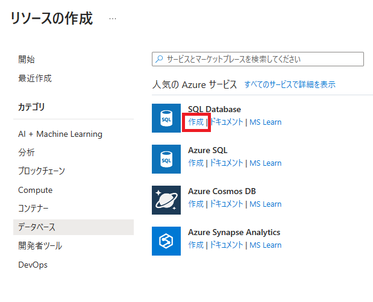

- SQL データベースの作成

  - **サーバー** の **新規作成** をクリック
 
  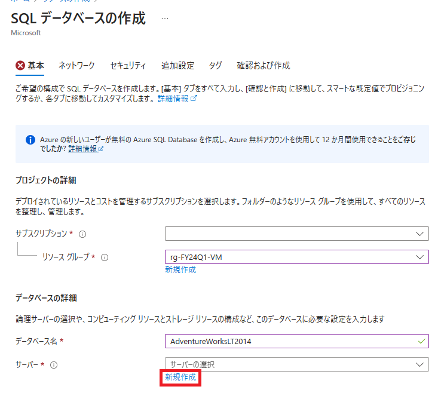

  - SQL Database サーバーの作成

    - **サーバーの詳細**

      - **サーバー名**: 任意

      - **場所**: リソース グループと同じリージョンを選択
    
    - **認証**

      - **認証方法**: SQL と Azure AD 認証の両方を使用する

      - **Azure AD 管理者の設定をする**: **管理者の設定** をクリック、サインイン中のユーザーを選択

      - **サーバー管理者ログイン**: sqladmin

      - **パスワード**: 任意 (8 文字以上、128 文字以下、英数字、記号の３つ以上を含む)

        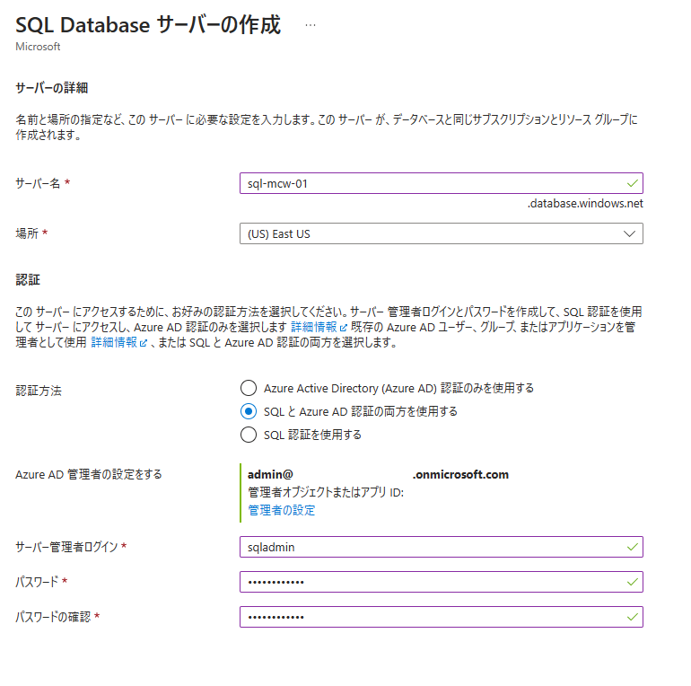

  - **コンピューティングとストレージ** の **データベースの構成** をクリック

    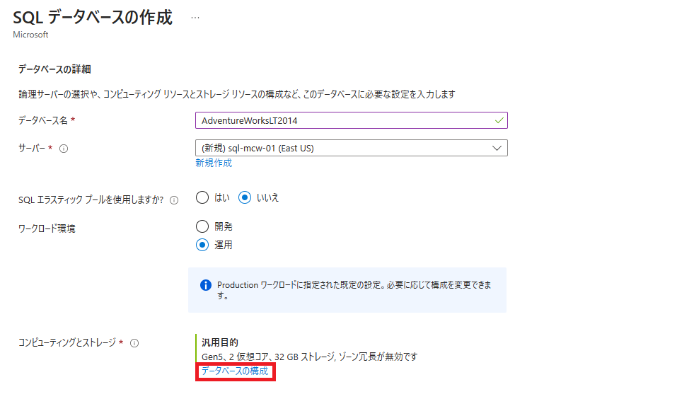

    - **構成**

      - **サービス レベル**: 汎用目的 (スケーラブルな計算とストレージのオプション)

      - **コンピューティング レベル**: プロビジョニング済み

      - **コストの削減**: いいえ

      - **仮想コア**: 2

      - **データの最大サイズ (GB)**: 5

      - **このデータベース ゾーンに冗長性を持たせますか**: いいえ

        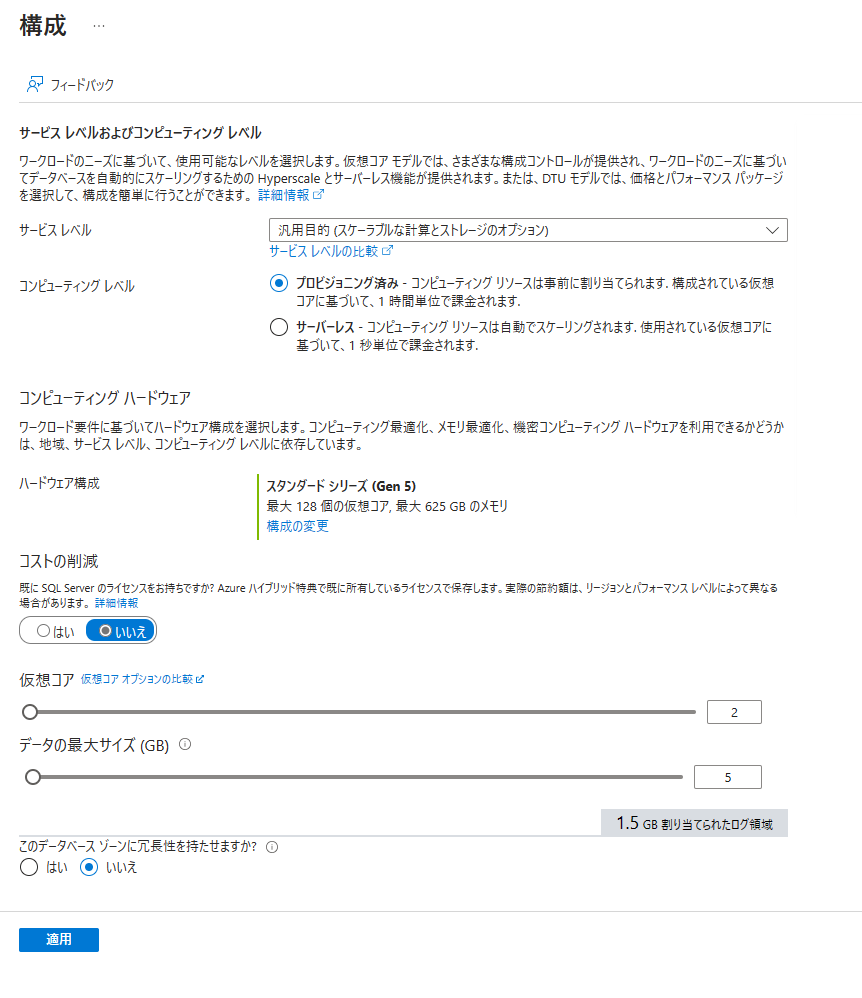

  - **基本**

    - **プロジェクトの詳細**

      - **サブスクリプション**: ワークショップで使用中のサブスクリプション

      - **リソース グループ**: ワークショップで使用中のリソース グループ
    
    - **データベースの詳細**

      - **データベース名**: AdventureWorksLT2014

      - **サーバー**: 作成した SQL Database サーバー

      - **SQL エラスティック プールを使用しますか**: いいえ

      - **ワークロード環境**: 運用

      - **コンピューティングとストレージ**: 汎用目的 (Gen5, 2 仮想コア, 5GB ストレージ, ゾーン冗長無効)
    
    - **バックアップ ストレージの冗長性**

      - **バックアップ ストレージの冗長性**: ローカル冗長バックアップ ストレージ

      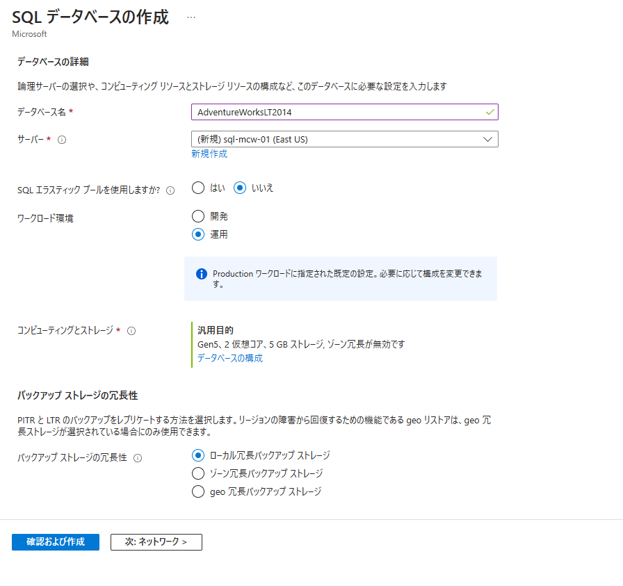

  - **ネットワーク**

    - **ネットワーク接続**

      - **接続方法**: アクセスなし

    - **接続ポリシー**

      - **接続ポリシー**: 既定
    
    - **暗号化接続**

      - **TLS の最小バージョン**: TLS 1.2

      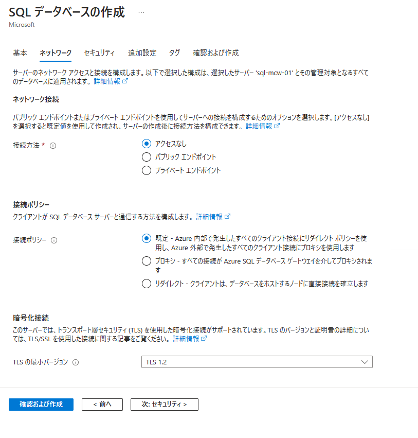

  - **セキュリティ**

    - **Microsoft Defender for SQL を有効にする**: 後で

    - **台帳**: 構成されていません

    - **Server Identity**: 無効

    - **Server level key**: 選択済みのサービス マネージド キー

    - **Database level key (preview)**: 構成されていません

      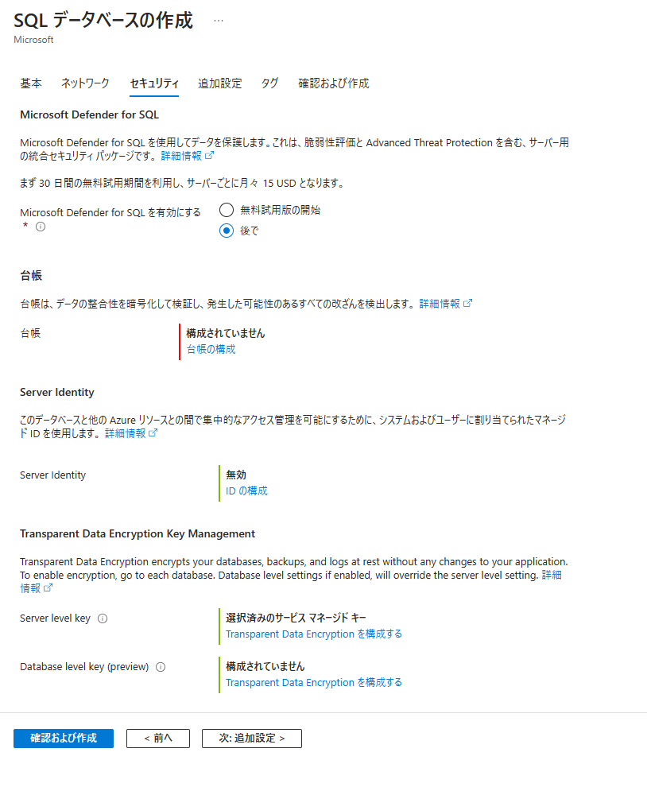

  - **追加設定**

    - **既定のデータを使用します**: なし

    - **照合順序**: SQL_Latin_1_General_CP1_CI_AS

    - **メンテナンス期間**: システムの既定値 (午後 5 時から午前 8 時)

      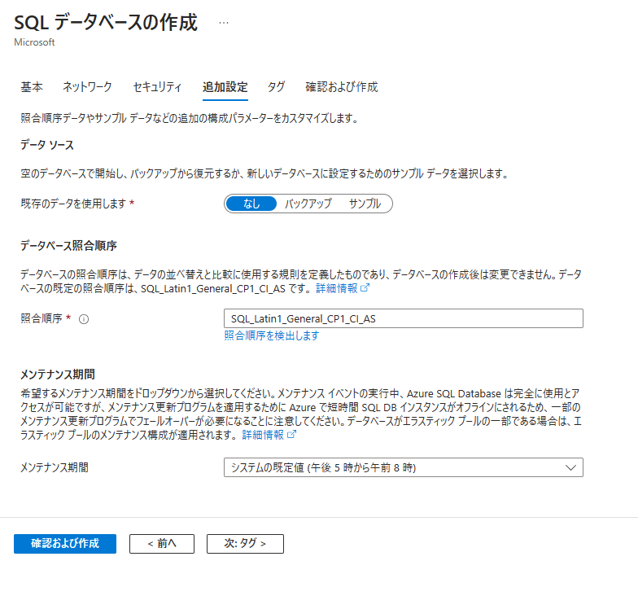

- **確認および作成** をクリック

- **作成** をクリック

  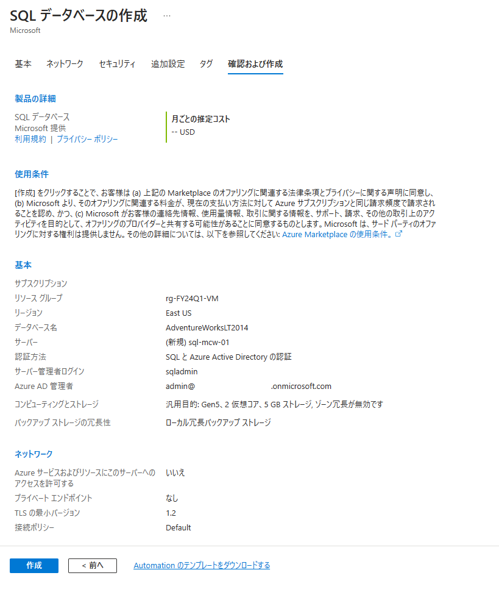

 

### Task 2: サーバー ファイアウォールの設定

- 仮想マシンのグローバル IP アドレスを確認

  ※ [My Global IP](https://www.myglobalip.com/) などのサイトを利用

- 作成した SQL Database の管理ブレードへ移動

- **パブリック ネットワーク アクセス** で **選択したネットワーク** を選択

  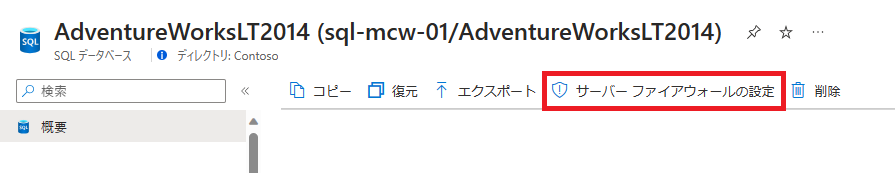

- **＋ ファイアウォール ルールの追加** をクリック

  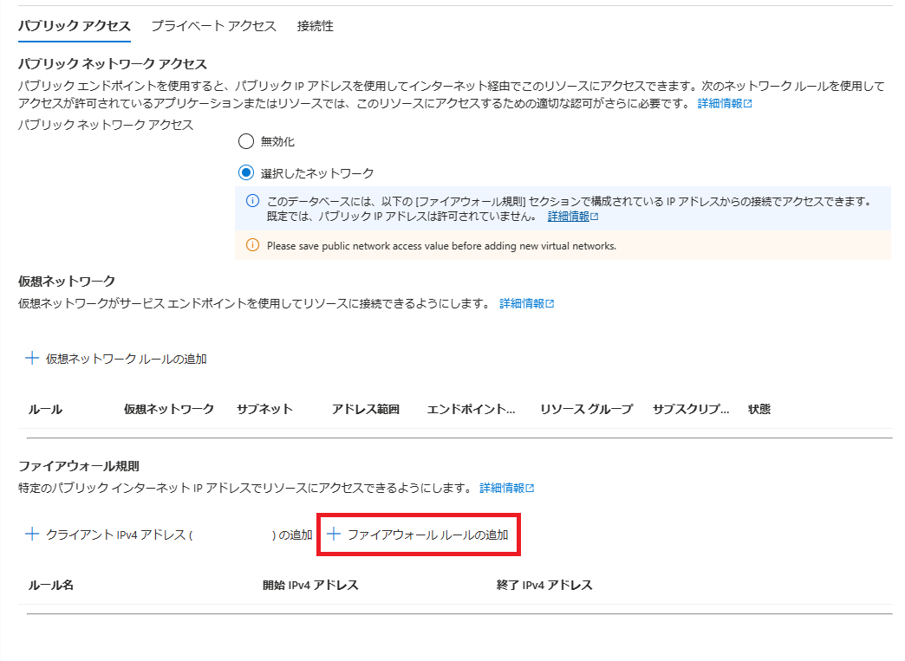

- ファイアウォール ルール名、確認した仮想マシンのグローバル IP アドレスを入力し **OK** をクリック

  - **ルール名**: AzureDataStudio

  - **開始 IP**: 仮想マシンのグローバル IP アドレス

  - **終了 IP**: 仮想マシンのグローバル IP アドレス

    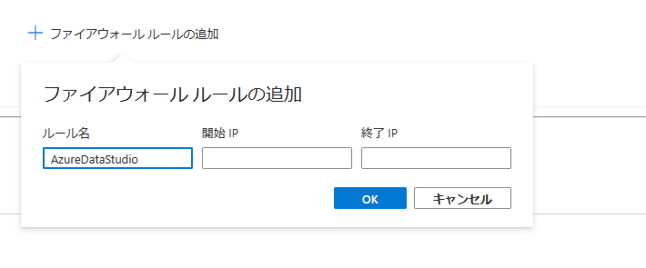

- **保存** をクリック

  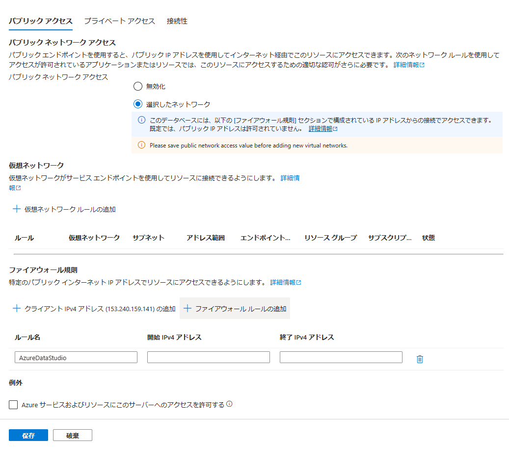

 

## Exercise 3

### Task 1: Azure Data Studio のインストール

- Web ブラウザを起動し

- [Azure Data Studio のダウンロードとインストール](https://learn.microsoft.com/ja-jp/sql/azure-data-studio/download-azure-data-studio?view=sql-server-ver16&tabs=redhat-install%2Credhat-uninstall) サイトへアクセス

- Windows ユーザー インストーラーの **64 ビット** をクリック

  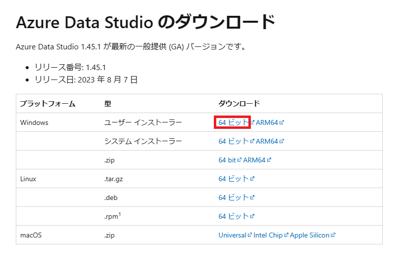

- ダウンロード完了後、**Openfile** をクリックし、インストーラーを起動

- Setup メッセージが表示されるので **OK** をクリック

- **I accept the agreement** を選択し **Next** をクリック

  

- インストール先を確認し **Next** をクリック

  

- **Next** をクリック

  

- **Create a desktop icon**, **Add to PATH** を選択し **Next** をクリック

  

- **Install** をクリック

  

- **Launch Azure Data Studio** にチェックが付いていることを確認し **Finish** をクリック

  

 

### Task 2: 拡張機能のインストール

- Azure Data Studio を起動、画面左の Extensions (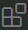) をクリック

  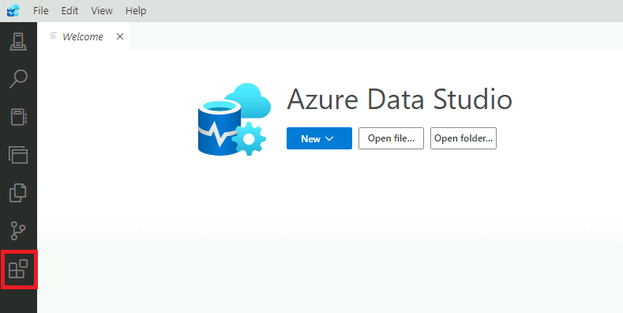

- 検索バーに **azure sql** と入力、表示される候補より **Azure SQL Migration** を選択

  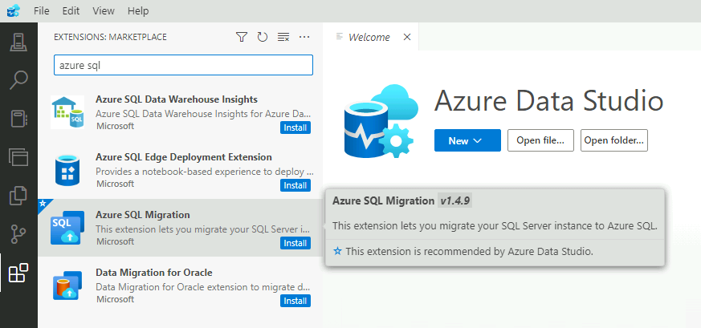

- **Install** をクリック

  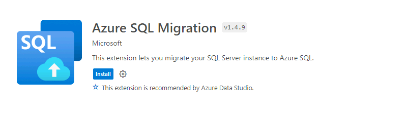

- **検索バー** に **sql database** と入力、表示される候補より **SQL Database Projects** を選択

  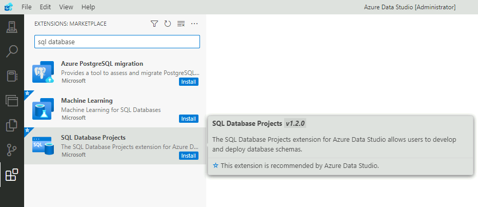

- **Install** をクリック (同時に SQL Server Schema Compare 拡張機能もインストール)

- ３つの拡張機能がインストールされていることを確認

  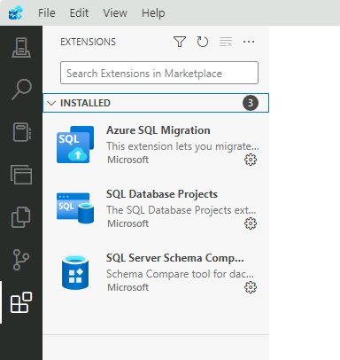

 

## Exercise 4

### Task 1: SQL Server, SQL Database への接続

- 画面左の Connections () をクリック

- **New Connection** をクリック

  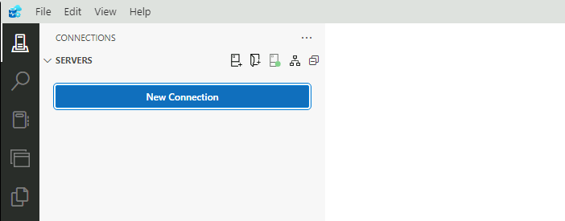

- **Connection Details** に必要なパラメーターを入力し **Connect** をクリック

  - **Connection Type**: Microsoft SQL Server

  - **Input type**: Parameters

  - **Serer**: 移行元 SQL Server 名

  - **Authentication type**: SQL Login

  - **User name**: sqladmin

  - **Password**: パスワード

  - **Remember password**: オン

  - **Database**: Default

  - **Encrypt**: Mandatory (True)

  - **Trust server certificate**: False

  - **Server group**: Default

    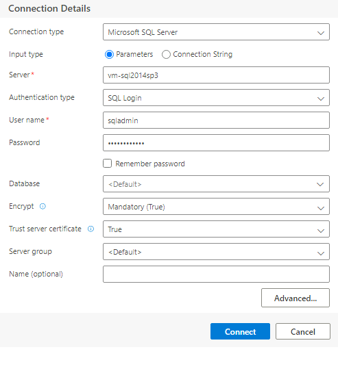

    ※ SQL Server 名、管理者、パスワードは講師に確認

- Connection erro メッセージが表示されるので **Enable Trust server certificate** をクリック

  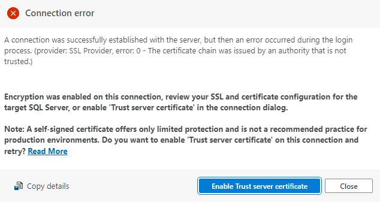

- SQL Server へ接続

  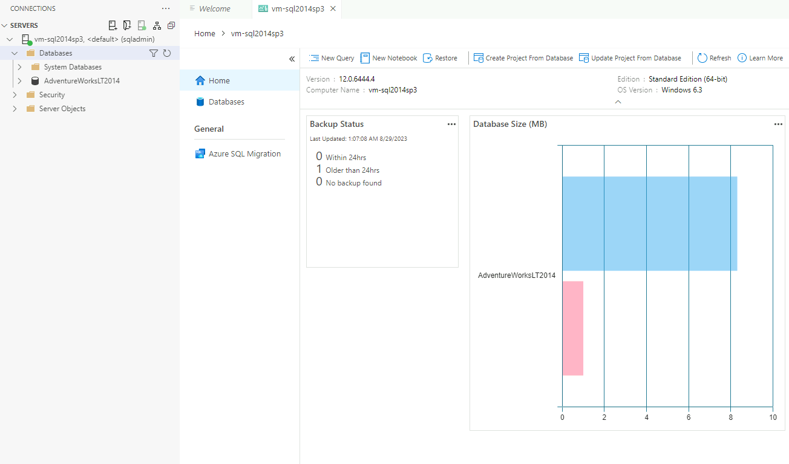

- **New Connection** () をクリック

  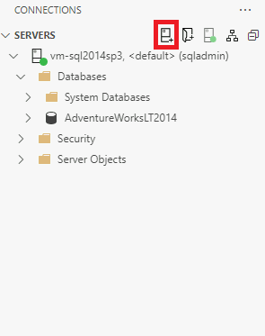

- **Connection Details** に必要なパラメーターを入力し **Connect** をクリック

  - **Connection Type**: Microsoft SQL Server

  - **Input type**: Parameters

  - **Serer**: 移行先 SQL Database サーバー名

  - **Authentication type**: SQL Login

  - **User name**: sqladmin

  - **Password**: パスワード

  - **Remember password**: オン

  - **Database**: Default

  - **Encrypt**: Mandatory (True)

  - **Trust server certificate**: True

  - **Server group**: Default

    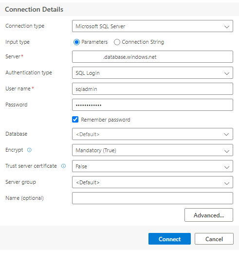

- SQL Database へ接続

  

 

### Task 2: データベース スキーマの移行

- 移行元 SQL Server のデータベース (AdvantureWorksLT2014) を右クリックし **Schema Compare** をクリック

  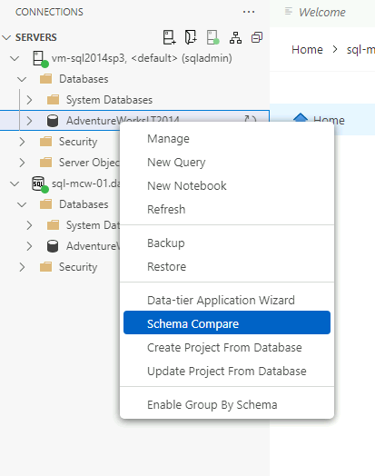

- Target の **...** をクリック

  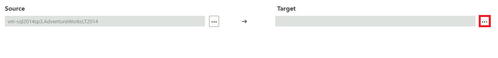

- **Source**, **Target** の **Type**, **Server**, **Database** を選択し **OK** をクリック

  - **Source**

    - **Type**: Database

    - **Server**: 移行元 SQL Server

    - **Database**: AdventureWorksLT2014
  
  - **Target**

    - **Type**: Database

    - **Server**: 移行先 SQL Database

    - **Database**: AdventureWorksLT2014

    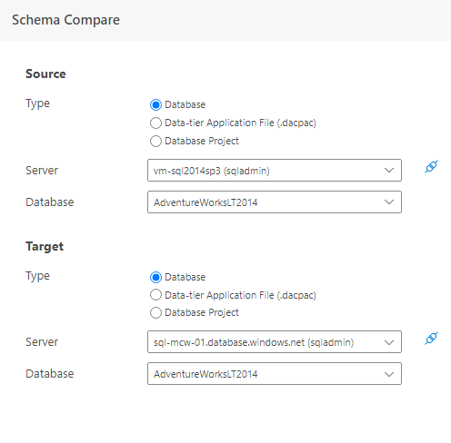

- **Options** をクリック

  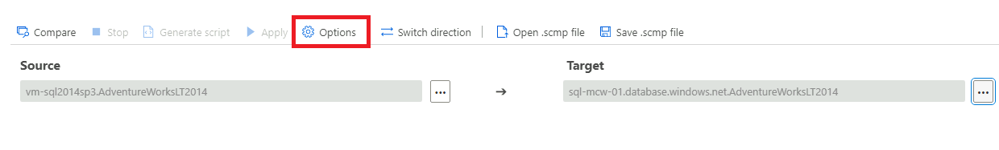

- **Include Object Types** タブを選択、**Database Roles**, **Filegroups**, **Users** のチェックを外し **OK** をクリック

  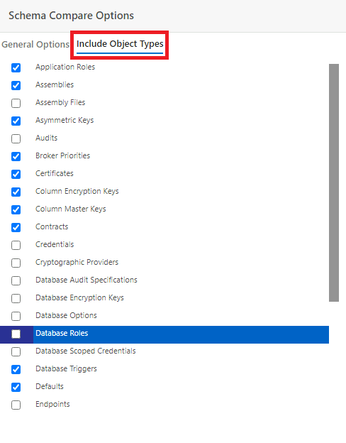

- **Compare** をクリック

  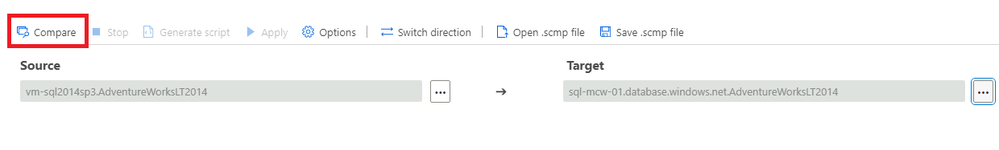

- **Apply** をクリックして、データベース スキーマの移行を実行

  ※ メッセージが表示されるので **Yes** をクリック

  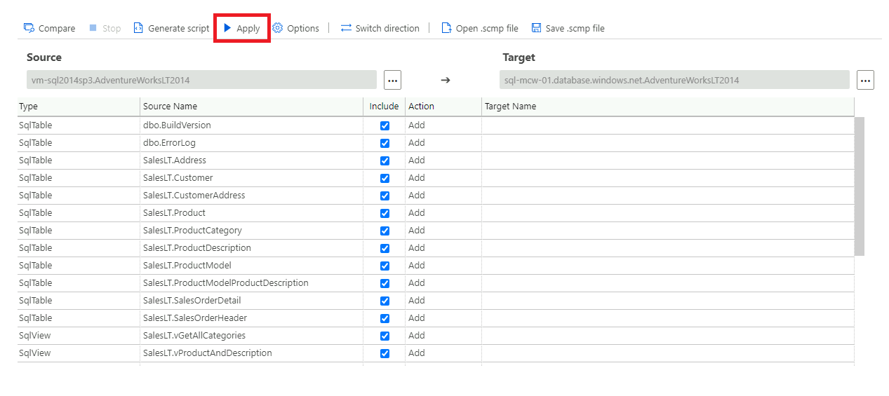

- データベース スキーマが移行されたことを確認

  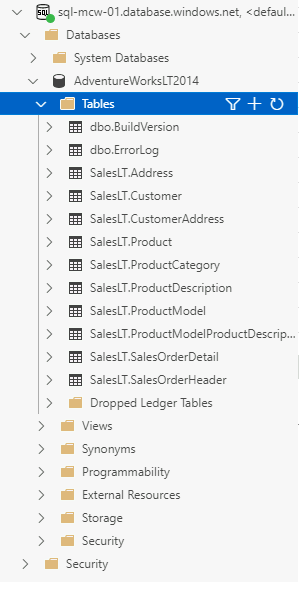

- **SalesLT.Product** テーブルを右クリックし **Select Top 100** を選択

  

- テーブルにデータが登録されていないことを確認

  

 

## Exercise 5

### Task 1: データベースの移行

- 移行元 SQL Server の AdventureWorksLT2014 データベースを右クリックし **Manage** を選択

  

- **Azure SQL Migration** を選択し **Migrate to Azure SQL** をクリック

  

- **AdventureWorksLT2014** データベースを選択し **Next** をクリック

  

  ※ 移行対象データベースの評価を実行

- **Azure SQL Database** を選択、**View/Select** をクリック

  

- SQL Database への移行に問題が検出されないことを確認し **Select** をクリック

  

  ※ 移行先 SQL Database のサイジング (本ワークショップでは下記手順は不要です)

  - **Get Azure recommendation**

    - **Collect perfomance data now** を選択、パフォーマンス データを保存する場所を指定し **Start** をクリック

      
    
    - パフォーマンス データの取得を開始
    
      (最小 10 分、Azure Data Studio 起動中は **Stop data collection** をクリックするまで取得を継続)

      
    
    - パフォーマンス データ取得後、**View details** をクリック

      
    
    - パフォーマンス データから推奨サイズを提示

      

           

- **Next** をクリック

  

- **Link account** をクリックし、Azure へ接続

  

- **Add an account** をクリック、Web ブラウザが起動、Azure へ接続するための資格情報を入力し認証

  

- アカウント名が表示されていることを確認し **Close** をクリック

  

- 移行先の SQL Database サーバーの情報を入力し **Connect** をクリック

  - **Subscription**: ワークショップで使用中のサブスクリプション

  - **Location**: リソース グループのリージョン

  - **Resource Group**: ワークショップで使用中のリソース グループ

  - **Azure SQL Database Server**: 移行先の Azure SQL Database サーバー

  - **Target user name**: saladmin

  - **Target password**: パスワード

    

- **Target database** に **AdventureWorksLT2014** を選択し **Next** をクリック

  

- Azure Database Migration Service が選択され、セルフホステッド統合ランタイムと正常に接続されていることを確認し **Next** をクリック

  

- **Run validation** をクリック

  

- セルフホステッド統合ランタイム、ソース、ターゲットへの接続を確認、**Done** をクリック

  

- **Edit** をクリック

  

- すべてのテーブルが選択されていることを確認し **Update** をクリック

  

- **Next** をクリック

  

- 指定した内容を確認し **Start migration** をクリック

  

- **Dashboard** で **Database migrations in progress** をクリック

  

- 移行の進行状況を確認

  

- **Dashboard** で **Database migrations completed** をクリック、正常に移行が完了したことを確認

  

- SQL Database の **SalesLT.Product** テーブルを右クリックし **Select Top 100** を選択

  

- データが移行されていることを確認

  

 

## Exercise 6

### Task 1: メンテナンス期間の構成

- Azure ポータルで SQL Database の管理ブレードを表示、**メンテナンス** を選択

- **メンテナンス期間** から **10:00 PM から 6:00 AM タイムゾーン, 金曜日 から 日曜日** を選択

  ※ タイムゾーンは SQL Database が展開されているリージョンのものが表示

  

- **はい** をクリック

  

 

### Task 2: バックアップの構成

- SQL Database の **概要** に表示されるサーバー名をクリック

- **バックアップ** を選択し **保有ポリシー** をクリック、データベースを選択し **ポリシーの構成** をクリック

  

- バックアップの保有期間を 35 日間に変更し **適用** をクリック

  

- ポリシー適用を確認するメッセージが表示されるので **はい** をクリック

  

 
